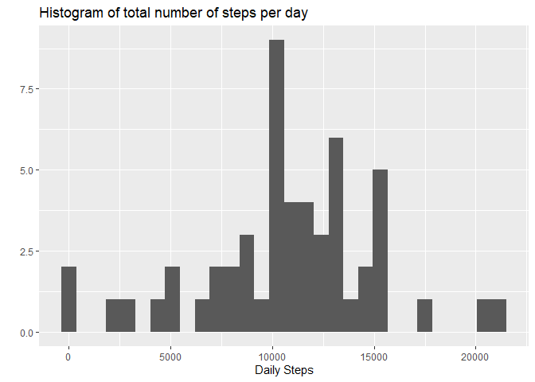
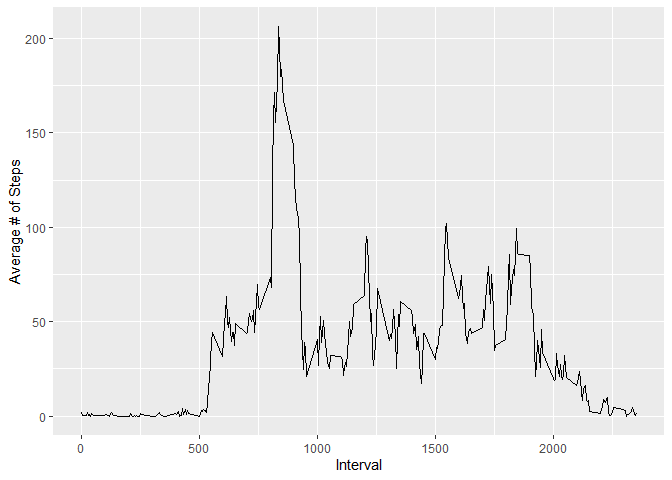
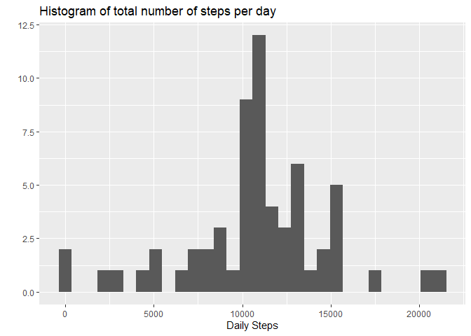
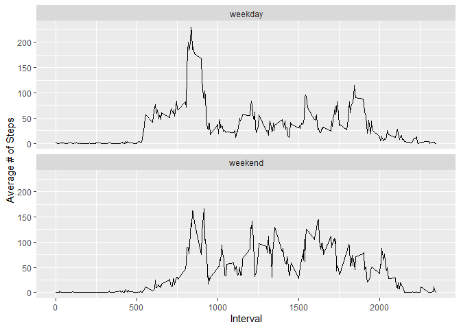

## Loading and preprocessing the data

```r
unzip("activity.zip")
data <- read.csv("activity.csv", colClasses = c("integer","Date","integer"))
```


## What is mean total number of steps taken per day?

```r
byday <- data %>% group_by(date) %>% 
    summarize(stepstotal = sum(steps))
qplot(byday$stepstotal, geom = "histogram", xlab = "Daily Steps",
      main = "Histogram of total number of steps per day")
```

<!-- -->


```r
stepsmean <- mean(byday$stepstotal, na.rm = TRUE)
stepsmedian <- median(byday$stepstotal, na.rm = TRUE)
```

The **mean** of the total number of steps taken by day is 1.0766189\times 10^{4}.

The **median** of the total number of steps taken by day is 10765.

## What is the average daily activity pattern?

```r
byinterval <- data %>% group_by(interval) %>% summarize(stepsmean = mean(steps, na.rm = TRUE))
maxinterval <- byinterval[which.max(byinterval$stepsmean),]
ggplot(data=byinterval, aes(x=interval, y=stepsmean)) + geom_line() + 
    ylab("Average # of Steps") + xlab("Interval")
```

<!-- -->

Interval 835 is the interval with the most average steps (206.1698113) on a day.

## Imputing missing values

```r
complete <- sum(complete.cases(data))
rowswithNAs <- nrow(data) - complete
```
The dataset contains 2304 rows with `NA` values.

In order to impute the missign values we will use the daily average for the given interval with the missing value instead.


```r
impute <- function(x, intervalaverage) {
    if (is.na(x[1,1])) {
        interval <- x[1,3]
        x[1,1] <- intervalaverage[intervalaverage$interval == interval,2]
    }
    x
}

imputeddata <- data
for(i in 1:nrow(imputeddata)) {
    row <- imputeddata[i,]
    imputeddata[i,] <- impute(row, byinterval)
}
```

Histogram of total number of steps per day with imputed data.

```r
bydayimputed <- imputeddata %>% group_by(date) %>% 
    summarize(stepstotal = sum(steps))
qplot(bydayimputed$stepstotal, geom = "histogram", xlab = "Daily Steps",
      main = "Histogram of total number of steps per day")
```

<!-- -->


```r
stepsmeanimputed <- mean(bydayimputed$stepstotal)
meandiff <- abs(stepsmean - stepsmeanimputed)
stepsmedianimputed <- median(bydayimputed$stepstotal)
mediandiff <- abs(stepsmedian - stepsmedianimputed)
```

The **mean** of the total number of steps taken by day is 1.0766189\times 10^{4}.
The difference to the mean of the original data is 0.

The **median** of the total number of steps taken by day is 1.0766189\times 10^{4}.
The difference to the median of the original data is 1.1886792.

## Are there differences in activity patterns between weekdays and weekends?


```r
weekend <- grepl("S(at|un)", weekdays(imputeddata$date))
daytype <- factor (weekend, labels = c("weekday","weekend"))

imputeddata <- cbind(imputeddata,daytype)
byintervalimputed <- imputeddata %>% group_by(interval,daytype) %>% summarize(stepsmean = mean(steps))
ggplot(data=byintervalimputed, aes(x=interval, y=stepsmean)) + geom_line() + 
    ylab("Average # of Steps") + xlab("Interval")+ facet_wrap(~daytype,ncol = 1)
```

<!-- -->


